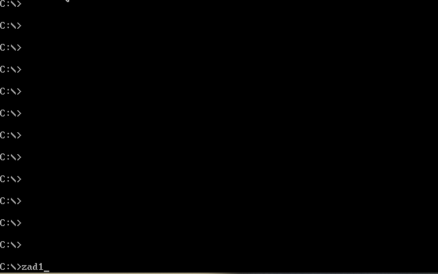
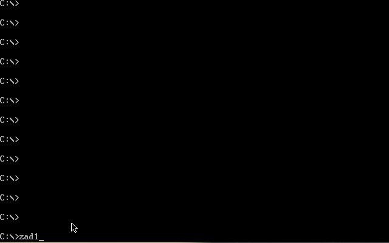
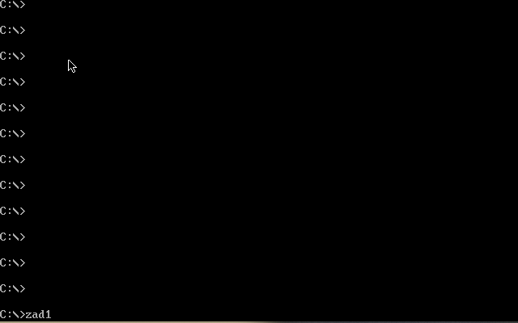
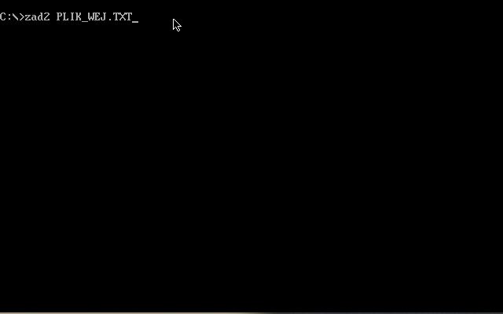

# Asemblery

Zadania realizowane podczas kursu `Programowanie w języku Asembler` na AGH UST w roku akademickim 2021/2022

## Zadanie 1

Opis:

Proszę napisać program obliczający miejsce zerowe funkcji liniowej o wzorze:
y=ax+b

Po uruchomieniu, program prosi o podanie parametrów a i b funkcji, po czym na ekranie wyświetla:

- współrzędną X dla której funkcja ta przyjmuje wartość 0
- współrzędną Y dla X=0

Następnie, korzystając ze znaków ASCII, wyświetla na ekranie (w trybie tekstowym) prowizoryczny wykres funkcji na tle zaznaczonych osi układu współrzędnych XY.

Pod wykresem powinna być wyświetlona rozdzielczość osi układu współrzędnych.

Przykładowe wywołanie:

Przy możliwym dzieleniu przez 0 nawet cmp zrobione :)

Minusik tez zrobiony

Ograniczenie (max 8) wynika ze stałej skali wykresu, który się rysuje na ekranie.

## Zadanie 2

Opis:

Napisać program rysujący na ekranie figury geometryczne na podstawie danych umieszczonych w pliku wejściowym o nazwie podawanej przy wywołaniu.

Figury powinny być rysowane w trybie VGA: 320x200 256-kolorów w jednym z trzech kolorów: czerwonym, zielonym lub niebieskim (R, G, B). Proszę traktować ekran jako pierwszą ćwiartkę układu współrzędnych. Początek układu współrzędnych znajduje się w lewym dolnym rogu ekranu.

Po narysowaniu wszystkich figur, przed powrotem do systemu, program powinien czekać na wciśnięcie klawisza.

Format pliku wejściowego:

Kolejne linie pliku określają poszczególne figury do wyświetlenia na ekranie. Każda taka linia zawiera na początku literę określającą kolor figury, a następnie ciąg par współrzędnych wierzchołków figury.

Kolejne wierzchołki powinny być połączone liniami. Należy również narysować linię łączącą ostatni punkt z pierwszym.

Przykład pliku wejściowego:

(rysuje czerwony kwadrat i niebieski trójkąt):

R  0,0  70,0  70,70  0,70

B  100,80  150,110  200,40

Przykład wywołania Programu:

- program2 dane.wej

Przykładowe wywołanie (z plikiem w repozytorium):

